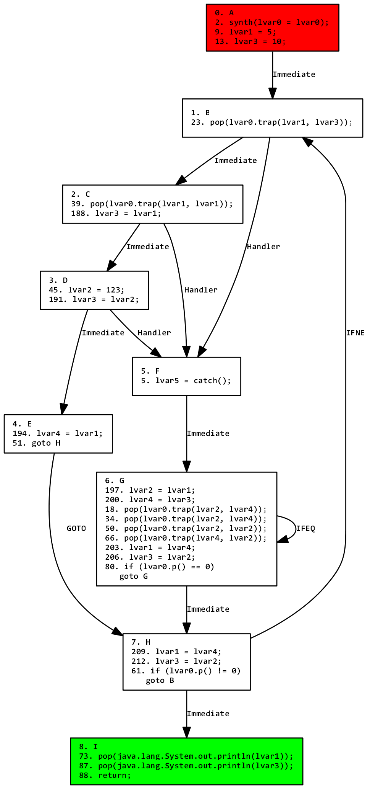

# Maple-IR

Maple-IR is an industrial IR-based static analysis framework for Java bytecode.
Currently, it implements SSA-form based analysis as well as construction and destruction from bytecode to IR.
The toolchain takes bytecode input, lifts it to SSA IR, transforms the IR, then recompiles back down to bytecode.
This is done by symbolically executing each method while simulating the stack, similar to how Binary Ninja or IDA Pro's Hex-Rays operate.
Intraprocedural data-flow analysis is fully implemented, and optimizations such as constant folding and copy propogation are implemented as well.
A CFG Graphviz exporter is also available; see below for examples.

Maple-IR is not in active development. It is on hiatus indefinitely, although code contributions are welcome.
Please file questions, comments, and issues on the [issue tracker](https://github.com/LLVM-but-worse/maple-ir/issues).

Maple-IR in its current form is not yet production-ready, although it can be made so with little effort.

**If you use Maple-IR, please let us know!** We would love to hear about any cool projects you use it for.


*"It's like LLVM, but worse."*

## Features
- Java bytecode (prefix stack-based) to SSA IR (infix AST)
- SSA IR to bytecode reassembly
- Visual (graphviz) and text pretty printer
- Text input to IR parsing; human-editable IR (*planned*)

## Philosophy
 - Enter IR and stay in IR, abstract away ASM/JVM-specific details
 - Transform the IR then reassemble deobfuscated code
 - Aim for semantic correctness

## Screenshots and examples
Here is the Graphviz visualization for the optimized, destructed (post-SSA) IR for the following code:

```java
void test130() {
    int x = 5;
    int y = 10;

    do {
        try {
            trap(x, y);
            y = x;
            trap(x, y);
            y = 123;
        } catch (RuntimeException e) {
            do {
                trap(x, y);
                int z = y;
                trap(x, y);
                y = x;
                trap(x, y);
                x = z;
                trap(x, y);
            } while(!p());
        }
    } while(p());

    System.out.println(x);
    System.out.println(y);
}
```



---
Here is a [nastier function](https://github.com/JetBrains/intellij-community/blob/1818a362f64eb2aed725e42df16e0476fe096d13/plugins/java-decompiler/engine/src/org/jetbrains/java/decompiler/struct/StructContext.java#L67), in optimized SSA form, taken from the Fernflower decompiler:


## Technical details
SSA destruction is implemented using the methods of [Sreedhar et al.](https://pdfs.semanticscholar.org/b4e0/f3301cffb358e836ee2964a0316e1b263974.pdf) and [Boissinot et al.](https://hal.inria.fr/inria-00349925/file/RR.pdf). The [Boissinot destructor](./org.mapleir.ir/src/main/java/org/mapleir/ir/algorithms/BoissinotDestructor.java) is currently the default destructor.
SSA construction is implemented based on a fast 1-pass linear scan algorithm loosely based on Cytron et al.'s method using dominance frontiers. For more details see [SSAGenPass.java](./org.mapleir.ir/src/main/java/org/mapleir/ir/cfg/builder/SSAGenPass.java).
Bytecode destruction is tricky in Java due to exception ranges. Furthermore, linearizing the control flow graph (CFG) in a simple manner is difficult due to loop nesting. Linearization is handled by recursively applying Tarjan's superconnected components algorithm. Exception tables for each method are discarded and regenerated based on the control flow graph's structure. For more details, see [ControlFlowGraphDumper](./org.mapleir.ir/src/main/java/org/mapleir/ir/algorithms/ControlFlowGraphDumper.java).

For more details, see the [whitepaper](./docs/maple-ir.pdf).

## Caveats
- Interprocedural analysis has not been fully implemented (it's difficult).
- Many of the IR passes weren't designed with `javac` in mind. This means, for example, `finally` blocks are processed correctly, although not neatly.

## Compiling
To build:
```
mvn clean compile test package
```

The build will produce two jars, one with dependencies included (`mapleir-full.jar`), and one without (`mapleir-full-with-deps.jar`).
You can also use each module individually.

Then, optionally:
```
mvn install
```

You can also get Maple-IR on [Jitpack](https://jitpack.io/#LLVM-but-worse/maple-ir).

## Credits
 - [Bibl](https://github.com/t81lal)
 - [rcx](https://github.com/rcx)
 - [ObjectWeb ASM framework](http://asm.ow2.org/index.html)

Contact: Please file an issue, I will do my best to respond as quickly as possible.

**sharing will lead to reported and beat down** (bless)

## License
Maple-IR is licensed under the GPLv3. For more information, please see [here](https://www.gnu.org/licenses/gpl-3.0.en.html).

Copyright (c) 2020 Bibl and rcx
